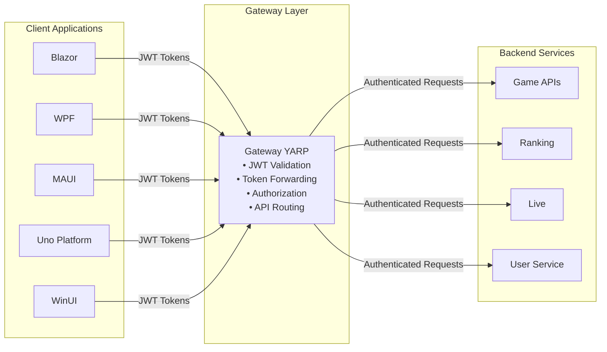

# Authentication Documentation

This directory contains comprehensive documentation for authentication and authorization in the Codebreaker platform.

## Current Implementation Status

**The Codebreaker project is migrating to Microsoft Entra External ID** for authentication. The documentation reflects the target implementation using Entra External ID.

## Documentation Files

### [Microsoft Entra External ID Configuration Guide](./microsoft-external-id.md) ✅ **Target Implementation**

Comprehensive guide for the target authentication setup:
- Gateway configuration with Microsoft Entra External ID
- Token flow architecture between Gateway and APIs
- Blazor Server and Blazor WebAssembly client configuration
- Desktop client configuration (WPF, .NET MAUI, Uno Platform, WinUI)
- Security best practices
- Troubleshooting common issues

**When to use**: Reference this guide for implementing and maintaining Microsoft Entra External ID authentication.

### [Azure AD B2C Configuration Guide](./azure-ad-b2c.md) ⚠️ **Legacy Reference**

Guide for the previous authentication implementation:
- Legacy Azure AD B2C configuration
- Migration considerations
- Comparison with Entra External ID
- Deprecation timeline

**When to use**: Reference this guide only for migration from Azure AD B2C or understanding legacy implementations.

### [Quick Start Guide](./quick-start.md)

Fast-track guide with:
- 5-minute setup instructions for Entra External ID
- Common configuration patterns
- Code snippets for each platform
- Quick troubleshooting tips

**When to use**: Use this guide when you need to quickly set up authentication or find a specific code snippet.

### [Architecture Diagrams](./architecture-diagrams.md)

Visual documentation with:
- High-level architecture diagrams
- Authentication flow diagrams for web and desktop
- Token flow through Gateway
- Security boundaries visualization
- Token lifecycle diagrams

**When to use**: Reference these diagrams to understand the system architecture and authentication flows visually.

## Overview

The Codebreaker platform uses **Microsoft Entra External ID** for identity and access management across all client applications and backend services.

### Architecture



### Key Components

1. **Gateway (YARP Reverse Proxy)**
   - Entry point for all API requests
   - JWT token validation using Microsoft Entra External ID
   - Authorization policy enforcement
   - Token forwarding to backend services

2. **Backend Services**
   - Game APIs, Ranking, Live, User services
   - Can optionally validate tokens (defense in depth)
   - Extract user claims for business logic

3. **Client Applications**
   - Multiple platforms supported
   - MSAL for desktop/mobile authentication
   - Microsoft.Identity.Web for Blazor
   - Automatic token management

## Getting Started

### For New Developers

1. Read the [Microsoft Entra External ID Guide](./microsoft-external-id.md) for current implementation
2. Use the [Quick Start Guide](./quick-start.md) for fast setup
3. Configure authentication for your specific platform
4. Test with the provided code snippets

### For Migration from Azure AD B2C

1. Review the [Azure AD B2C Migration Guide](./azure-ad-b2c.md)
2. Understand the differences between B2C and External ID
3. Update configuration endpoints and settings
4. Test thoroughly before production deployment

## Platform Support Matrix

| Platform | Authentication Library | Current Status | Documentation |
|----------|----------------------|----------------|---------------|
| Gateway (YARP) | Microsoft.Identity.Web | ✅ Entra External ID | [Entra External ID](./microsoft-external-id.md#gateway-configuration) |
| Game APIs | Microsoft.Identity.Web | ⚠️ Optional | [Entra External ID](./microsoft-external-id.md#game-apis-service-configuration) |
| Blazor Server | Microsoft.Identity.Web | ✅ Supported | [Entra External ID](./microsoft-external-id.md#blazor-server-configuration) |
| Blazor WASM | MSAL.js | ✅ Supported | [Entra External ID](./microsoft-external-id.md#blazor-webassembly-wasm-configuration) |
| WPF | MSAL.NET | ✅ Supported | [Entra External ID](./microsoft-external-id.md#wpf-configuration) |
| .NET MAUI | MSAL.NET | ✅ Supported | [Entra External ID](./microsoft-external-id.md#net-maui-configuration) |
| Uno Platform | MSAL.NET | ✅ Supported | [Entra External ID](./microsoft-external-id.md#uno-platform-configuration) |
| WinUI 3 | MSAL.NET | ✅ Supported | [Entra External ID](./microsoft-external-id.md#winui-3-configuration) |

## Configuration Overview

### Target Implementation (Microsoft Entra External ID)

All platforms require:

1. **Microsoft Entra External ID Tenant**: Configured with user flows
2. **App Registration**: One per platform/client type
3. **Redirect URIs**: Platform-specific callback URLs
4. **Client ID**: Application (client) ID from app registration
5. **Authority URL**: External ID tenant endpoint (*.ciamlogin.com)

### Environment Variables (Target)

Development:
```bash
EntraExternalId__Instance=https://your-tenant.ciamlogin.com
EntraExternalId__Domain=your-tenant.onmicrosoft.com
EntraExternalId__TenantId=<tenant-id>
EntraExternalId__ClientId=<client-id>
```

Production (use Azure Key Vault):
```bash
az keyvault secret set --vault-name gateway-keyvault \
  --name "EntraExternalId--ClientSecret" \
  --value "<secure-password>"
```

## Common Scenarios

### Scenario 1: Web Application (Blazor)

**Use Case**: Public-facing web application with user authentication

**Setup**:
- Blazor Server or Blazor WASM
- Microsoft Entra External ID for authentication
- Gateway forwards authenticated requests to APIs

**Documentation**: [Entra External ID Blazor Configuration](./microsoft-external-id.md#blazor-client-configuration)

### Scenario 2: Desktop Application (WPF/MAUI)

**Use Case**: Native desktop/mobile application

**Setup**:
- MSAL.NET for authentication
- Microsoft Entra External ID authority
- Direct API calls through Gateway

**Documentation**: [Entra External ID Desktop Configuration](./microsoft-external-id.md#desktop-client-configuration)

### Scenario 3: Anonymous + Authenticated Users

**Use Case**: Game supporting both guest and registered players

**Setup**:
- Anonymous user service for guest accounts
- Optional authentication upgrade to Entra External ID
- Mixed authorization policies

**Documentation**: 
- [User Service README](../../src/services/user/README.md)
- [Gateway Configuration](./microsoft-external-id.md#gateway-configuration)

## Security Considerations

### Critical Security Practices

1. **Never commit secrets**: Use Azure Key Vault or user secrets
2. **Use HTTPS in production**: HTTP only for local development
3. **Validate tokens at multiple layers**: Gateway AND API services
4. **Implement proper CORS**: Don't use `AllowAnyOrigin()` in production
5. **Rotate secrets regularly**: Set up automated secret rotation
6. **Monitor authentication**: Log and alert on suspicious activity

See [Entra External ID Security Guide](./microsoft-external-id.md#security-best-practices) for detailed guidance.

## Troubleshooting

### Quick Diagnostics (Target Implementation)

```bash
# Check if Entra External ID token is valid
curl -H "Authorization: Bearer <token>" https://your-gateway-url.com/games

# Decode JWT token
# Visit https://jwt.ms and paste your token

# Test Entra External ID authentication endpoint
curl https://your-tenant.ciamlogin.com/<tenant-id>/v2.0/.well-known/openid-configuration
```

### Common Issues

1. **CORS errors**: See [Entra External ID Troubleshooting](./microsoft-external-id.md#2-cors-errors-in-browser)
2. **Token validation failures**: Check Entra External ID configuration
3. **Redirect URI mismatch**: Verify Entra External ID app registration
4. **Authority not found**: Check tenant ID and ciamlogin.com endpoint

Full troubleshooting guide: [Entra External ID Troubleshooting](./microsoft-external-id.md#troubleshooting)

## Migration from Azure AD B2C

### Migration Checklist

If migrating from Azure AD B2C to Microsoft Entra External ID:

1. **Setup External ID tenant**:
   - Create new Entra External ID tenant
   - Configure user flows
   - Create app registrations

2. **Update configuration**:
   - Change endpoints from *.b2clogin.com to *.ciamlogin.com  
   - Update configuration sections from AzureAdB2C to EntraExternalId
   - Update authority URLs to include tenant ID

3. **Test migration**:
   - Test with non-production workloads first
   - Validate token compatibility
   - Verify all client platforms

4. **Resources**:
   - [Microsoft Entra External ID Guide](./microsoft-external-id.md)
   - [Migration Reference](./azure-ad-b2c.md)

## Additional Resources

### Official Microsoft Documentation

- [Microsoft Entra External ID](https://learn.microsoft.com/en-us/entra/external-id/) ✅ **Current**
- [Azure AD B2C Documentation](https://learn.microsoft.com/en-us/azure/active-directory-b2c/) ⚠️ **Legacy**
- [MSAL.NET](https://learn.microsoft.com/en-us/azure/active-directory/develop/msal-overview)
- [Microsoft.Identity.Web](https://learn.microsoft.com/en-us/azure/active-directory/develop/microsoft-identity-web)

### Codebreaker Resources

- [Gateway Service](../../src/services/gateway/) ✅ **Uses Entra External ID**
- [User Service](../../src/services/user/)
- [Game APIs](../../src/services/gameapis/)
- [Main README](../../README.md)

### Sample Code

- [Microsoft Entra External ID Samples](https://github.com/Azure-Samples?q=external-id) ✅ **Current**
- [Codebreaker Backend Repository](https://github.com/CodebreakerApp/Codebreaker.Backend)

## Contributing

Found an issue or have a suggestion? 

1. Check existing [issues](https://github.com/CodebreakerApp/Codebreaker.Backend/issues)
2. Open a new issue with details
3. Submit a pull request with improvements

## Support

For questions or issues:

- **Current implementation**: Use [Microsoft Entra External ID Guide](./microsoft-external-id.md)
- **Migration questions**: See [Azure AD B2C Migration Guide](./azure-ad-b2c.md)
- **Microsoft Identity issues**: See [Official Documentation](https://learn.microsoft.com/en-us/entra/external-id/)

## License

This documentation is part of the Codebreaker project. See [LICENSE](../../LICENSE) for details.
