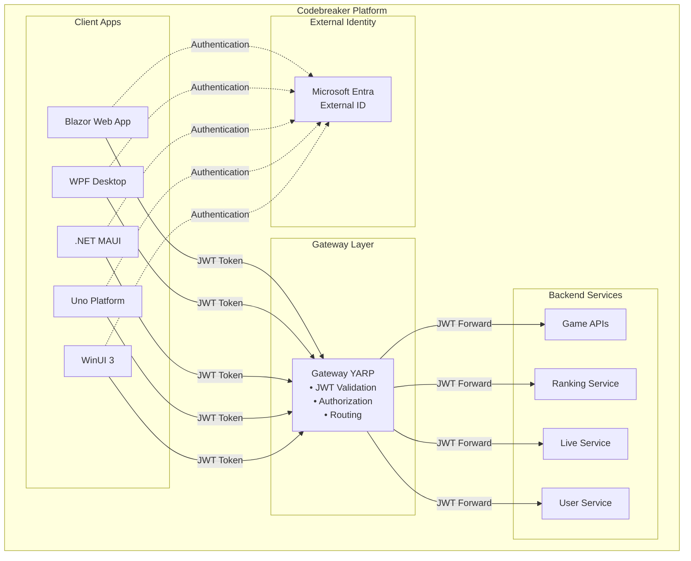
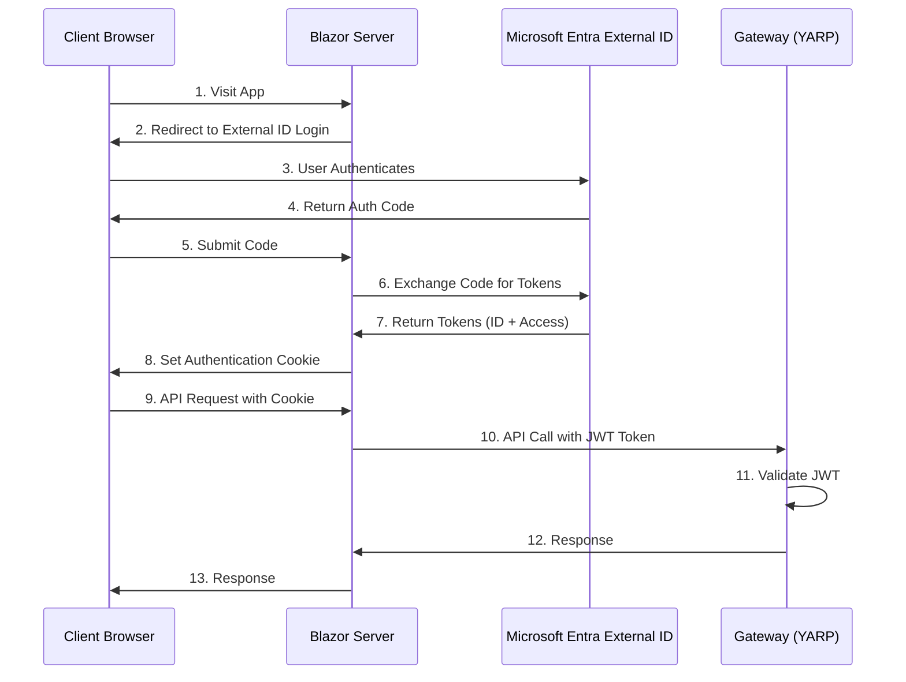
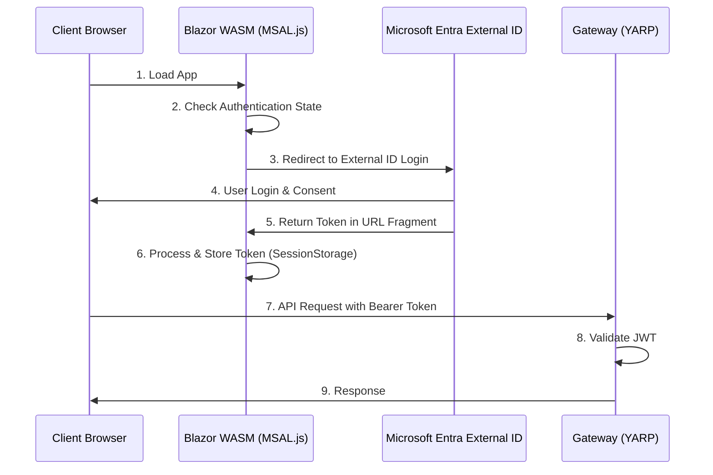
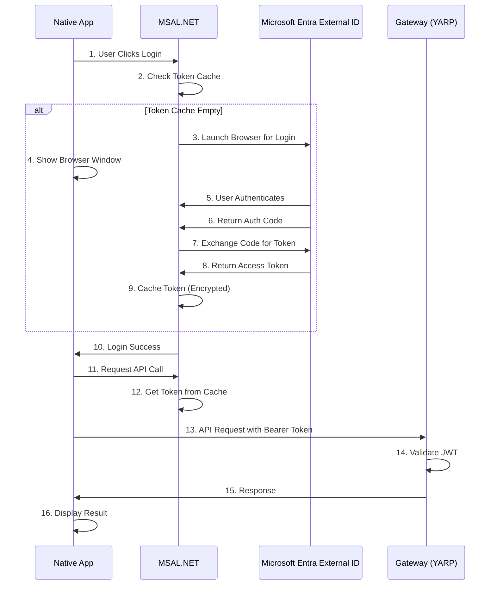
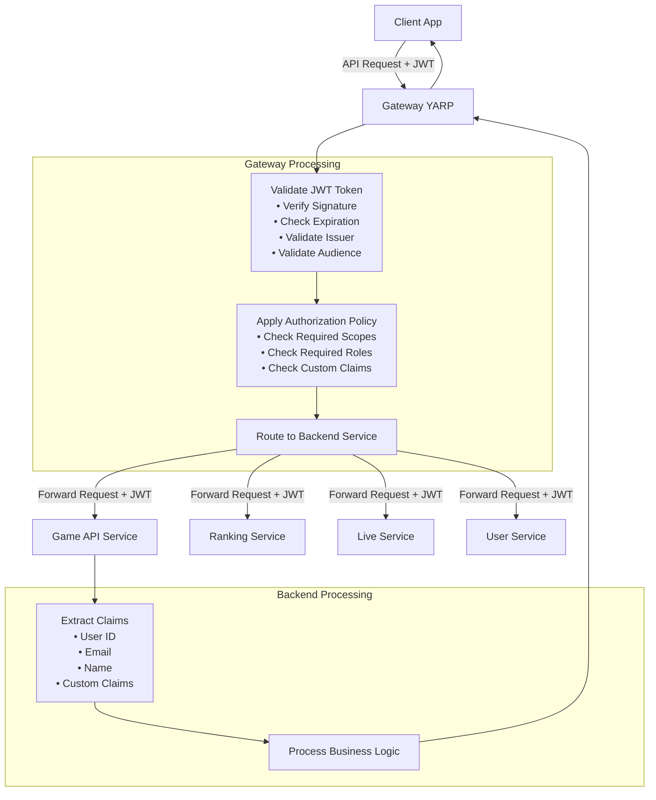
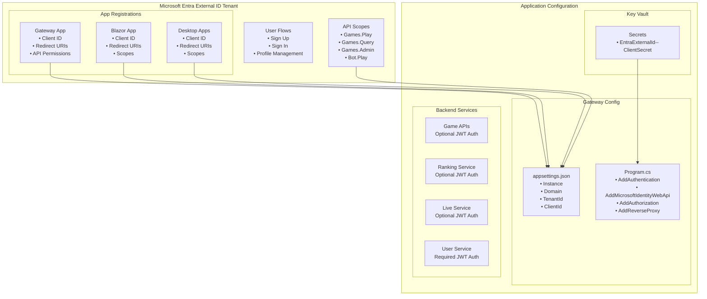
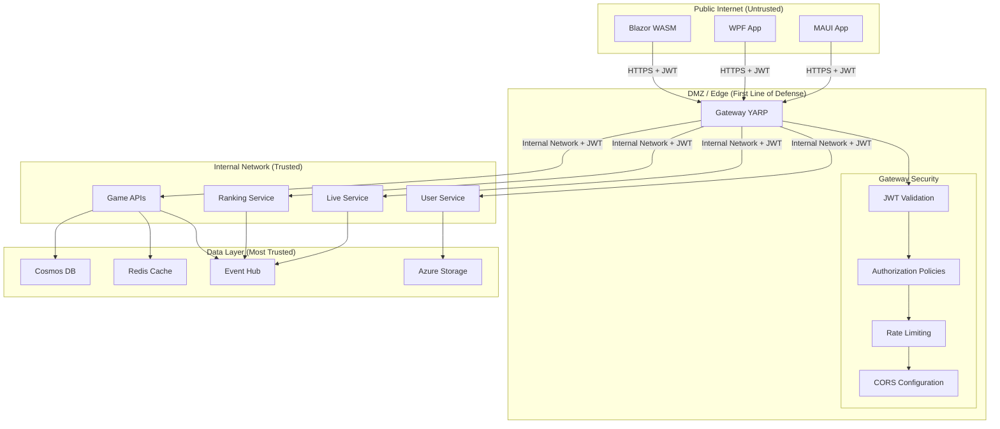
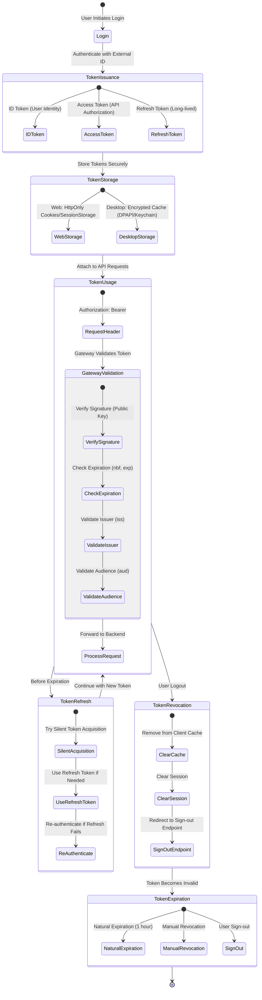
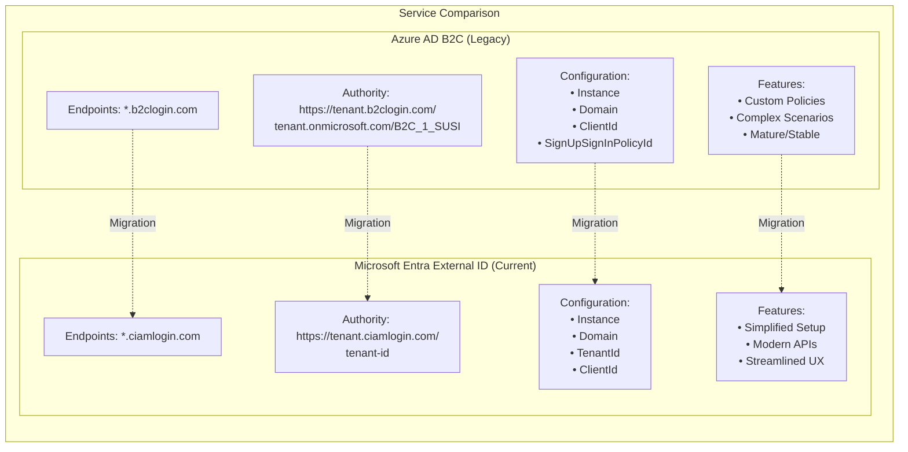
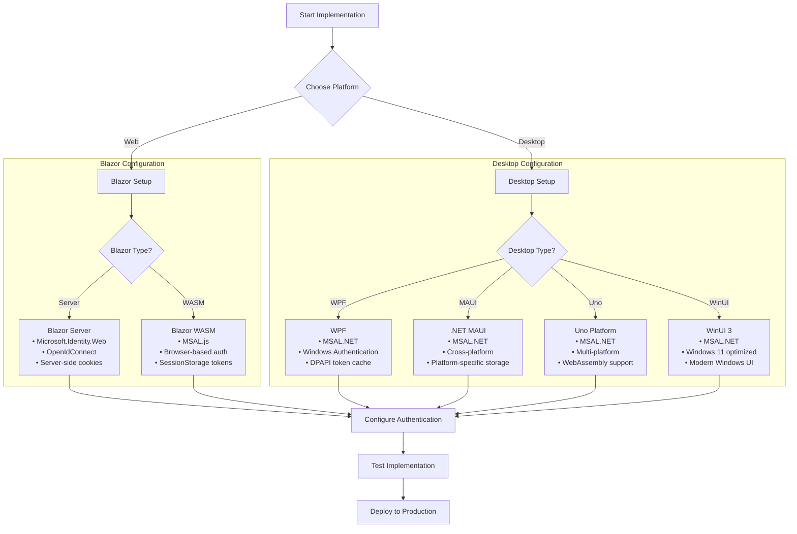

# Microsoft Entra External ID Architecture Diagrams

This document provides visual representations of the authentication flows in the Codebreaker platform using Microsoft Entra External ID.

## High-Level Architecture

## Authentication Flow (Web - Blazor)

### Blazor Server

### Blazor WebAssembly

## Authentication Flow (Desktop - Native Apps)

### WPF, WinUI, MAUI, Uno Platform

## Token Flow Through Gateway

## Configuration Components

## Security Boundaries

## Token Lifecycle

## Comparison: Azure AD B2C vs Microsoft Entra External ID

## Platform-Specific Configuration Flow

## See Also

- [Microsoft Entra External ID Configuration Guide](./microsoft-external-id.md)
- [Quick Start Guide](./quick-start.md)
- [Authentication Overview](./README.md)
- [Azure AD B2C Migration Guide](./azure-ad-b2c.md)
