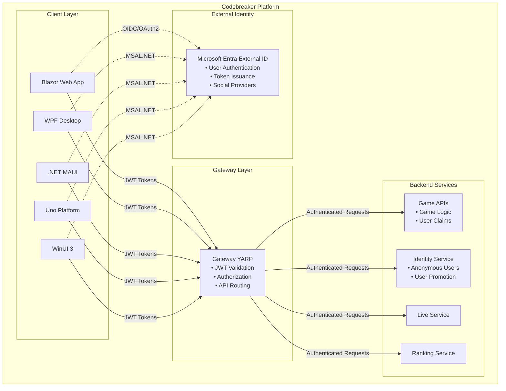
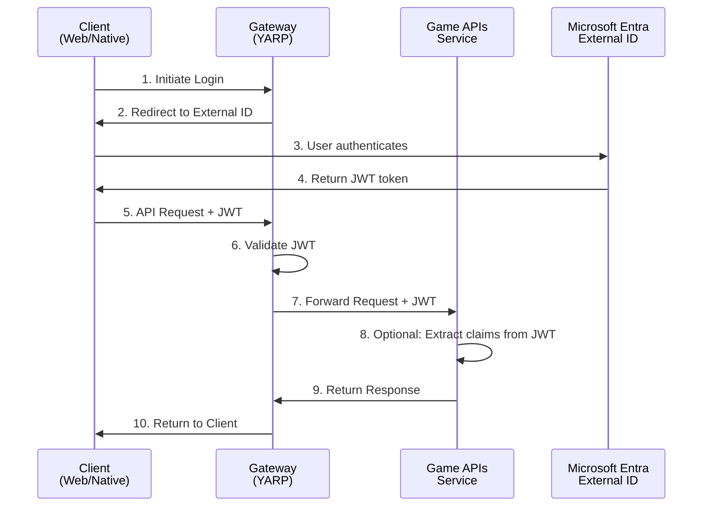
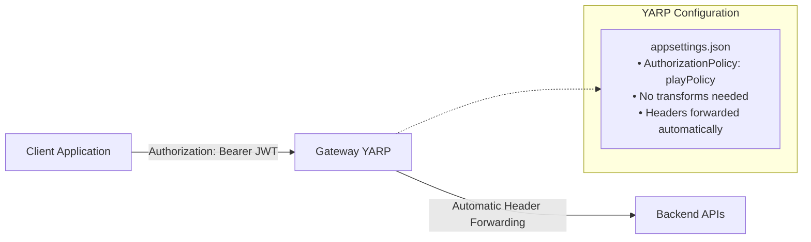

# Microsoft Entra External ID Configuration Guide

This guide provides comprehensive instructions for configuring Microsoft Entra External ID authentication across the Codebreaker platform components.

## Overview

Microsoft Entra External ID provides a modern identity and access management solution for external-facing applications. The Codebreaker platform uses External ID to:

- Authenticate users across web and native clients
- Provide secure token-based API access
- Enable social identity provider integration
- Support anonymous and authenticated user scenarios

### Architecture Components



**Key Components:**
- **Gateway (YARP Reverse Proxy)**: Entry point for all API requests, handles JWT validation
- **Game APIs**: Backend services protected by JWT authentication
- **Identity Service**: Manages anonymous user creation and promotion
- **Clients**: Web (Blazor), Desktop (WPF, MAUI, Uno, WinUI)

## Table of Contents

- [Overview](#overview)
- [Prerequisites](#prerequisites)
- [Gateway Configuration](#gateway-configuration)
- [Token Flow Architecture](#token-flow-architecture)
- [Game APIs Service Configuration](#game-apis-service-configuration)
- [Blazor Client Configuration](#blazor-client-configuration)
- [Desktop Client Configuration](#desktop-client-configuration)
- [Security Best Practices](#security-best-practices)
- [Troubleshooting](#troubleshooting)
- [Migration from Azure AD B2C](#migration-from-azure-ad-b2c)

## Prerequisites

Before configuring Microsoft Entra External ID, ensure you have:

1. **Azure Subscription**: Active Azure subscription with permissions to create resources
2. **Microsoft Entra ID Tenant**: Either create a new tenant or use existing
3. **External ID Configuration**: Set up External ID for customers
4. **App Registrations**: Create separate app registrations for:
   - Gateway/API (backend)
   - Each client platform (web, WPF, MAUI, etc.)

### Setting Up Microsoft Entra External ID

1. Navigate to [Microsoft Entra admin center](https://entra.microsoft.com)
2. Go to **External Identities** → **External ID for customers**
3. Create a new tenant or use an existing one
4. Configure sign-up and sign-in user flows

## Gateway Configuration

The Gateway service (YARP reverse proxy) acts as the authentication entry point for all backend services.

### 1. Configure appsettings.json

Add the following configuration to your Gateway's `appsettings.json`:

```json
{
  "EntraExternalId": {
    "Instance": "https://<your-tenant-name>.ciamlogin.com",
    "Domain": "<your-tenant-name>.onmicrosoft.com",
    "TenantId": "<tenant-id>",
    "ClientId": "<gateway-app-client-id>",
    "CallbackPath": "/signin-oidc",
    "SignedOutCallbackPath": "/signout-callback-oidc"
  }
}
```

**Configuration Parameters:**

| Parameter | Description | Example |
|-----------|-------------|---------|
| `Instance` | Entra External ID login endpoint | `https://codebreaker3000.ciamlogin.com` |
| `Domain` | Your tenant domain | `codebreaker3000.onmicrosoft.com` |
| `TenantId` | Directory (tenant) ID | `12345678-1234-1234-1234-123456789012` |
| `ClientId` | Application (client) ID | `f528866c-c051-4e1e-8309-91831d52d8b5` |
| `CallbackPath` | Callback path after sign-in | `/signin-oidc` |
| `SignedOutCallbackPath` | Callback path after sign-out | `/signout-callback-oidc` |

### 2. Configure Program.cs

The Gateway uses Microsoft.Identity.Web for JWT bearer authentication with Entra External ID:

```csharp
using Microsoft.AspNetCore.Authentication.JwtBearer;
using Microsoft.Identity.Web;

var builder = WebApplication.CreateBuilder(args);

// Add Azure Key Vault for secrets management
builder.Configuration.AddAzureKeyVaultSecrets("gateway-keyvault");

// Configure JWT Bearer authentication for Entra External ID
builder.Services.AddAuthentication(JwtBearerDefaults.AuthenticationScheme)
    .AddMicrosoftIdentityWebApi(builder.Configuration.GetSection("EntraExternalId"));

// Define authorization policies
builder.Services.AddAuthorizationBuilder()
    .AddPolicy("playPolicy", config =>
    {
        config.RequireAuthenticatedUser();
        // Optional: Add scope requirements
        // config.RequireScope("Games.Play");
    })
    .AddPolicy("rankingPolicy", config =>
    {
        config.RequireAuthenticatedUser();
    })
    .AddPolicy("botPolicy", config =>
    {
        config.RequireAuthenticatedUser();
    })
    .AddPolicy("livePolicy", config =>
    {
        config.RequireAuthenticatedUser();
    });

var app = builder.Build();

app.UseAuthentication();
app.UseAuthorization();

app.MapReverseProxy();
```

### 3. Configure Reverse Proxy Routes

Update `appsettings.json` to apply authorization policies to routes:

```json
{
  "ReverseProxy": {
    "Routes": {
      "gamesRoute": {
        "ClusterId": "gamesapicluster",
        "AuthorizationPolicy": "playPolicy",
        "Match": {
          "Path": "/games/{*any}"
        }
      },
      "rankingRoute": {
        "ClusterId": "rankingcluster",
        "AuthorizationPolicy": "rankingPolicy",
        "Match": {
          "Path": "/ranking/{*any}"
        }
      }
    },
    "Clusters": {
      "gamesapicluster": {
        "Destinations": {
          "gamescluster/destination1": {
            "Address": "http://gameapis"
          }
        }
      }
    }
  }
}
```

### 4. Key Vault Configuration

Store sensitive configuration in Azure Key Vault:

```bash
# Add secrets to Key Vault
az keyvault secret set --vault-name gateway-keyvault \
  --name "EntraExternalId--ClientSecret" \
  --value "<secure-password>"
```

In your app registration:
1. Enable managed identity for the Gateway service
2. Grant Key Vault access policy to the managed identity
3. Use `builder.Configuration.AddAzureKeyVaultSecrets("gateway-keyvault")` to load secrets

## Token Flow Architecture

Understanding the token flow is crucial for proper authentication implementation.

### Authentication Flow Diagram



### Token Propagation from Gateway to APIs

The Gateway automatically forwards the JWT token to backend services. By default, YARP forwards the `Authorization` header with the JWT token:



## Game APIs Service Configuration

The Game APIs service receives and validates JWT tokens forwarded from the Gateway.

### Configuration Options

#### Option 1: No Authentication (Gateway Handles All)

If the Gateway is the only entry point and handles all authentication:

```csharp
// In Game APIs Program.cs
var builder = WebApplication.CreateBuilder(args);

builder.AddServiceDefaults();

// No authentication middleware needed
// Gateway validates tokens before forwarding requests

builder.AddApplicationServices();

var app = builder.Build();

app.MapGameEndpoints();
app.Run();
```

**Use Case**: When Game APIs are not exposed publicly and only accessible through the Gateway.

#### Option 2: Token Validation (Defense in Depth)

For additional security, validate tokens at the API level:

```csharp
using Microsoft.AspNetCore.Authentication.JwtBearer;
using Microsoft.Identity.Web;

var builder = WebApplication.CreateBuilder(args);

// Add JWT authentication
builder.Services.AddAuthentication(JwtBearerDefaults.AuthenticationScheme)
    .AddMicrosoftIdentityWebApi(builder.Configuration.GetSection("EntraExternalId"));

builder.Services.AddAuthorization();

var app = builder.Build();

app.UseAuthentication();
app.UseAuthorization();

app.MapGameEndpoints()
   .RequireAuthorization(); // Require authentication for all game endpoints

app.Run();
```

Add to `appsettings.json`:

```json
{
  "EntraExternalId": {
    "Instance": "https://<your-tenant-name>.ciamlogin.com",
    "Domain": "<your-tenant-name>.onmicrosoft.com",
    "TenantId": "<tenant-id>",
    "ClientId": "<api-app-client-id>"
  }
}
```

### Accessing User Claims in Game APIs

```csharp
// In your endpoint handlers
app.MapPost("/games", async (HttpContext context, IGameService gameService) =>
{
    var user = context.User;
    
    // Extract user information from claims
    var userId = user.FindFirst(ClaimTypes.NameIdentifier)?.Value;
    var email = user.FindFirst(ClaimTypes.Email)?.Value;
    var name = user.FindFirst(ClaimTypes.Name)?.Value;
    
    // Use user information in your business logic
    var game = await gameService.CreateGameAsync(userId, name);
    
    return Results.Ok(game);
});
```

## Blazor Client Configuration

Blazor applications can be hosted as Server or WebAssembly (WASM). Each has different authentication patterns.

### Blazor Server Configuration

Blazor Server uses server-side rendering with SignalR for interactivity.

#### 1. Install NuGet Packages

```bash
dotnet add package Microsoft.Identity.Web
dotnet add package Microsoft.Identity.Web.UI
```

#### 2. Configure appsettings.json

```json
{
  "EntraExternalId": {
    "Instance": "https://<your-tenant-name>.ciamlogin.com",
    "Domain": "<your-tenant-name>.onmicrosoft.com",
    "TenantId": "<tenant-id>",
    "ClientId": "<blazor-server-client-id>",
    "CallbackPath": "/signin-oidc",
    "SignedOutCallbackPath": "/signout-callback-oidc"
  }
}
```

#### 3. Configure Program.cs

```csharp
using Microsoft.AspNetCore.Authentication.OpenIdConnect;
using Microsoft.Identity.Web;
using Microsoft.Identity.Web.UI;

var builder = WebApplication.CreateBuilder(args);

// Add authentication
builder.Services.AddAuthentication(OpenIdConnectDefaults.AuthenticationScheme)
    .AddMicrosoftIdentityWebApp(builder.Configuration.GetSection("EntraExternalId"));

builder.Services.AddControllersWithViews()
    .AddMicrosoftIdentityUI();

builder.Services.AddAuthorization(options =>
{
    options.FallbackPolicy = options.DefaultPolicy;
});

// Add Blazor Server
builder.Services.AddRazorPages();
builder.Services.AddServerSideBlazor()
    .AddMicrosoftIdentityConsentHandler();

// Configure HttpClient to call APIs
builder.Services.AddHttpClient<IGameClient, GameClient>(client =>
{
    client.BaseAddress = new Uri(builder.Configuration["GatewayUrl"] ?? "https://localhost:7000");
})
.AddHttpMessageHandler<AuthorizationMessageHandler>();

var app = builder.Build();

app.UseAuthentication();
app.UseAuthorization();

app.MapControllers();
app.MapBlazorHub();
app.MapFallbackToPage("/_Host");

app.Run();
```

### Blazor WebAssembly (WASM) Configuration

Blazor WASM runs entirely in the browser and requires MSAL.js for authentication.

#### 1. Install NuGet Packages

```bash
dotnet add package Microsoft.Authentication.WebAssembly.Msal
```

#### 2. Configure wwwroot/appsettings.json

```json
{
  "EntraExternalId": {
    "Authority": "https://<your-tenant-name>.ciamlogin.com/<tenant-id>",
    "ClientId": "<blazor-wasm-client-id>",
    "ValidateAuthority": true
  },
  "GatewayUrl": "https://your-gateway-url.azurecontainerapps.io"
}
```

#### 3. Configure Program.cs

```csharp
using Microsoft.AspNetCore.Components.Web;
using Microsoft.AspNetCore.Components.WebAssembly.Hosting;
using Microsoft.Authentication.WebAssembly.Msal;

var builder = WebAssemblyHostBuilder.CreateDefault(args);
builder.RootComponents.Add<App>("#app");
builder.RootComponents.Add<HeadOutlet>("head::after");

// Configure MSAL authentication for Entra External ID
builder.Services.AddMsalAuthentication(options =>
{
    builder.Configuration.Bind("EntraExternalId", options.ProviderOptions.Authentication);
    options.ProviderOptions.DefaultAccessTokenScopes.Add("openid");
    options.ProviderOptions.DefaultAccessTokenScopes.Add("profile");
    // Add API scopes
    options.ProviderOptions.DefaultAccessTokenScopes.Add("https://<your-tenant>.onmicrosoft.com/<api-client-id>/Games.Play");
});

// Configure HttpClient with authentication
builder.Services.AddHttpClient<IGameClient, GameClient>(client =>
{
    client.BaseAddress = new Uri(builder.Configuration["GatewayUrl"] ?? "https://localhost:7000");
})
.AddHttpMessageHandler<BaseAddressAuthorizationMessageHandler>();

// Configure the handler to attach tokens
builder.Services.AddScoped<BaseAddressAuthorizationMessageHandler>();

await builder.Build().RunAsync();
```

## Desktop Client Configuration

Desktop clients (WPF, MAUI, Uno Platform, WinUI) use MSAL.NET for authentication.

### WPF Configuration

#### 1. Install NuGet Packages

```bash
dotnet add package Microsoft.Identity.Client
dotnet add package Microsoft.Identity.Client.Desktop
```

#### 2. Create Authentication Service

```csharp
using Microsoft.Identity.Client;
using System.Linq;
using System.Threading.Tasks;

public class AuthenticationService
{
    private readonly IPublicClientApplication _app;
    private readonly string[] _scopes;

    public AuthenticationService(string clientId, string authority, string[] scopes)
    {
        _scopes = scopes;
        
        _app = PublicClientApplicationBuilder
            .Create(clientId)
            .WithAuthority(authority)
            .WithDefaultRedirectUri() // Uses http://localhost for WPF
            .WithParentActivityOrWindow(() => System.Windows.Application.Current.MainWindow)
            .Build();

        // Enable token cache serialization
        TokenCacheHelper.EnableSerialization(_app.UserTokenCache);
    }

    public async Task<AuthenticationResult> SignInAsync()
    {
        AuthenticationResult result;
        
        try
        {
            // Try to acquire token silently first
            var accounts = await _app.GetAccountsAsync();
            result = await _app.AcquireTokenSilent(_scopes, accounts.FirstOrDefault())
                .ExecuteAsync();
        }
        catch (MsalUiRequiredException)
        {
            // Interactive authentication required
            result = await _app.AcquireTokenInteractive(_scopes)
                .ExecuteAsync();
        }

        return result;
    }

    public async Task<AuthenticationResult?> AcquireTokenSilentAsync()
    {
        try
        {
            var accounts = await _app.GetAccountsAsync();
            var account = accounts.FirstOrDefault();
            
            if (account == null)
                return null;

            return await _app.AcquireTokenSilent(_scopes, account)
                .ExecuteAsync();
        }
        catch (MsalException)
        {
            return null;
        }
    }

    public async Task SignOutAsync()
    {
        var accounts = await _app.GetAccountsAsync();
        
        foreach (var account in accounts)
        {
            await _app.RemoveAsync(account);
        }
    }
}
```

#### 3. Token Cache Helper

```csharp
using Microsoft.Identity.Client;
using System.IO;
using System.Security.Cryptography;

public static class TokenCacheHelper
{
    private static readonly string CacheFilePath = 
        Path.Combine(Environment.GetFolderPath(Environment.SpecialFolder.LocalApplicationData),
            "Codebreaker", "msal_cache.dat");

    public static void EnableSerialization(ITokenCache tokenCache)
    {
        tokenCache.SetBeforeAccess(BeforeAccessNotification);
        tokenCache.SetAfterAccess(AfterAccessNotification);
    }

    private static void BeforeAccessNotification(TokenCacheNotificationArgs args)
    {
        if (File.Exists(CacheFilePath))
        {
            var data = File.ReadAllBytes(CacheFilePath);
            var decryptedData = ProtectedData.Unprotect(data, null, DataProtectionScope.CurrentUser);
            args.TokenCache.DeserializeMsalV3(decryptedData);
        }
    }

    private static void AfterAccessNotification(TokenCacheNotificationArgs args)
    {
        if (args.HasStateChanged)
        {
            Directory.CreateDirectory(Path.GetDirectoryName(CacheFilePath)!);
            var data = args.TokenCache.SerializeMsalV3();
            var encryptedData = ProtectedData.Protect(data, null, DataProtectionScope.CurrentUser);
            File.WriteAllBytes(CacheFilePath, encryptedData);
        }
    }
}
```

#### 4. Configure in App.xaml.cs

```csharp
public partial class App : Application
{
    private AuthenticationService? _authService;

    protected override void OnStartup(StartupEventArgs e)
    {
        base.OnStartup(e);

        // Configuration for Entra External ID
        var clientId = "<wpf-client-id>";
        var authority = "https://<your-tenant-name>.ciamlogin.com/<tenant-id>";
        var scopes = new[] 
        { 
            "openid", 
            "profile",
            "https://<your-tenant>.onmicrosoft.com/<api-client-id>/Games.Play"
        };

        _authService = new AuthenticationService(clientId, authority, scopes);
        
        // Configure HttpClient and services...
    }
}
```

### .NET MAUI Configuration

.NET MAUI supports multiple platforms (iOS, Android, Windows, macOS) with a single codebase.

#### 1. Install NuGet Packages

```bash
dotnet add package Microsoft.Identity.Client
```

#### 2. Platform-Specific Configuration

##### Android (Platforms/Android/MainActivity.cs)

```csharp
using Android.App;
using Android.Content;
using Android.Content.PM;
using Microsoft.Identity.Client;

[Activity(Theme = "@style/Maui.SplashTheme", MainLauncher = true, 
    ConfigurationChanges = ConfigChanges.ScreenSize | ConfigChanges.Orientation)]
[IntentFilter(new[] { Intent.ActionView },
    Categories = new[] { Intent.CategoryBrowsable, Intent.CategoryDefault },
    DataHost = "auth",
    DataScheme = "msauth")]
public class MainActivity : MauiAppCompatActivity
{
    protected override void OnActivityResult(int requestCode, Result resultCode, Intent? data)
    {
        base.OnActivityResult(requestCode, resultCode, data);
        AuthenticationContinuationHelper.SetAuthenticationContinuationEventArgs(requestCode, resultCode, data);
    }
}
```

##### iOS (Platforms/iOS/AppDelegate.cs)

```csharp
using Foundation;
using Microsoft.Identity.Client;

[Register("AppDelegate")]
public class AppDelegate : MauiUIApplicationDelegate
{
    protected override MauiApp CreateMauiApp() => MauiProgram.CreateMauiApp();

    public override bool OpenUrl(UIApplication application, NSUrl url, NSDictionary options)
    {
        if (AuthenticationContinuationHelper.IsBrokerResponse(null))
        {
            AuthenticationContinuationHelper.SetBrokerContinuationEventArgs(url);
            return true;
        }

        return false;
    }
}
```

##### Windows

No additional platform-specific configuration required.

#### 3. Create MAUI Authentication Service

```csharp
using Microsoft.Identity.Client;

public class MauiAuthenticationService
{
    private readonly IPublicClientApplication _app;
    private readonly string[] _scopes;

    public MauiAuthenticationService(string clientId, string tenantId, string[] scopes)
    {
        _scopes = scopes;

        var builder = PublicClientApplicationBuilder
            .Create(clientId)
            .WithB2CAuthority($"https://<your-tenant>.b2clogin.com/tfp/{tenantId}/B2C_1_SUSI")
            .WithRedirectUri($"msauth.com.codebreakerapp.maui://auth");

#if ANDROID
        builder = builder.WithParentActivityOrWindow(() => Platform.CurrentActivity);
#elif IOS
        builder = builder.WithIosKeychainSecurityGroup("com.microsoft.adalcache");
#endif

        _app = builder.Build();
    }

    public async Task<AuthenticationResult> SignInAsync()
    {
        AuthenticationResult result;

        try
        {
            var accounts = await _app.GetAccountsAsync();
            result = await _app.AcquireTokenSilent(_scopes, accounts.FirstOrDefault())
                .ExecuteAsync();
        }
        catch (MsalUiRequiredException)
        {
            result = await _app.AcquireTokenInteractive(_scopes)
#if ANDROID
                .WithParentActivityOrWindow(Platform.CurrentActivity)
#endif
                .ExecuteAsync();
        }

        return result;
    }

    public async Task<AuthenticationResult?> GetTokenSilentlyAsync()
    {
        try
        {
            var accounts = await _app.GetAccountsAsync();
            return await _app.AcquireTokenSilent(_scopes, accounts.FirstOrDefault())
                .ExecuteAsync();
        }
        catch
        {
            return null;
        }
    }

    public async Task SignOutAsync()
    {
        var accounts = await _app.GetAccountsAsync();
        foreach (var account in accounts)
        {
            await _app.RemoveAsync(account);
        }
    }
}
```

#### 4. Configure in MauiProgram.cs

```csharp
public static class MauiProgram
{
    public static MauiApp CreateMauiApp()
    {
        var builder = MauiApp.CreateBuilder();
        builder
            .UseMauiApp<App>()
            .ConfigureFonts(fonts =>
            {
                fonts.AddFont("OpenSans-Regular.ttf", "OpenSansRegular");
            });

        // Authentication configuration for Entra External ID
        var clientId = "<maui-client-id>";
        var authority = "https://<your-tenant-name>.ciamlogin.com/<tenant-id>";
        var scopes = new[]
        {
            "openid",
            "profile",
            "https://<your-tenant>.onmicrosoft.com/<api-client-id>/Games.Play"
        };

        builder.Services.AddSingleton(new MauiAuthenticationService(clientId, authority, scopes));

        return builder.Build();
    }
}
```

## Security Best Practices

### 1. Token Security

- **Never store tokens in plain text**: Use platform-specific secure storage
- **Use token caching**: MSAL.NET provides built-in token caching with encryption
- **Implement token refresh**: Always try silent token acquisition before interactive

### 2. Secrets Management

- **Use Azure Key Vault**: Store sensitive configuration
- **Enable Managed Identity**: Avoid storing credentials in code
- **Rotate secrets regularly**: Set up secret rotation policies

### 3. API Security

- **Validate tokens at multiple layers**: Gateway AND API services
- **Use authorization policies**: Don't just check authentication
- **Implement scope-based access**: Use OAuth scopes for fine-grained permissions

### 4. Redirect URI Security

- **Use HTTPS in production**: HTTP only for local development
- **Register exact URIs**: Don't use wildcards
- **Platform-specific URIs**: Different URIs for each platform

## Troubleshooting

### Common Issues and Solutions

#### 1. "The access token provided is not valid" Error

**Cause**: Token validation failure

**Solutions**:
- Verify `ClientId` matches the app registration
- Check `Instance` and `TenantId` are correct
- Ensure token hasn't expired
- Verify audience claim matches expected value

#### 2. CORS Errors in Browser

**Cause**: Cross-Origin Resource Sharing not configured

**Solution**:
```csharp
// In Gateway/API Program.cs
builder.Services.AddCors(options =>
{
    options.AddDefaultPolicy(policy =>
        policy.WithOrigins("https://your-blazor-app.com")
              .AllowAnyMethod()
              .AllowAnyHeader()
              .AllowCredentials());
});

var app = builder.Build();
app.UseCors(); // Must be before UseAuthentication()
app.UseAuthentication();
app.UseAuthorization();
```

#### 3. Redirect URI Mismatch

**Cause**: Redirect URI in app doesn't match registration

**Solution**:
- Verify redirect URI in Microsoft Entra admin center
- Platform-specific URIs must match exactly
- Check for typos in scheme or host

### Debugging Tips

1. **Enable MSAL Logging**:
```csharp
var app = PublicClientApplicationBuilder
    .Create(clientId)
    .WithLogging((level, message, containsPii) =>
    {
        Console.WriteLine($"MSAL {level}: {message}");
    }, LogLevel.Verbose, enablePiiLogging: false, enableDefaultPlatformLogging: true)
    .Build();
```

2. **Use JWT Decoder**: Decode tokens at [jwt.ms](https://jwt.ms) to inspect claims

3. **Check Network Traffic**: Use browser dev tools or Fiddler to inspect tokens

## Migration from Azure AD B2C

### Key Differences

| Aspect | Azure AD B2C | Microsoft Entra External ID |
|--------|--------------|------------------------------|
| **Endpoints** | `*.b2clogin.com` | `*.ciamlogin.com` |
| **Authority Format** | `https://tenant.b2clogin.com/tenant.onmicrosoft.com/policy` | `https://tenant.ciamlogin.com/tenant-id` |
| **Configuration** | Policy-based (B2C_1_SUSI) | Tenant ID-based |
| **Features** | Full custom policies | Streamlined, modern APIs |

### Migration Steps

1. **Create Entra External ID tenant**
2. **Update configuration sections**:
   - Change from `AzureAdB2C` to `EntraExternalId`
   - Update endpoints from `*.b2clogin.com` to `*.ciamlogin.com`
   - Replace policy references with tenant ID

3. **Test thoroughly**:
   - Validate token compatibility
   - Test all client platforms
   - Verify claims mapping

## Additional Resources

### Official Documentation

- [Microsoft Entra External ID](https://learn.microsoft.com/en-us/entra/external-id/)
- [MSAL.NET Documentation](https://learn.microsoft.com/en-us/azure/active-directory/develop/msal-overview)
- [Microsoft.Identity.Web Documentation](https://learn.microsoft.com/en-us/azure/active-directory/develop/microsoft-identity-web)

### Related Codebreaker Documentation

- [Identity Service README](../../src/services/identity/README.md)
- [Gateway Configuration](../../src/services/gateway/Codebreaker.ApiGateway/README.md)
- [Game APIs Documentation](../../src/services/gameapis/README.md)

## Contributing

If you find issues with this documentation or have suggestions for improvement, please:

1. Open an issue in the repository
2. Submit a pull request with corrections
3. Contact the maintainers

## License

This documentation is part of the Codebreaker project and follows the same license terms.
