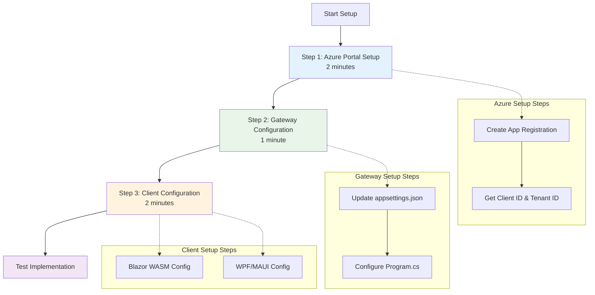
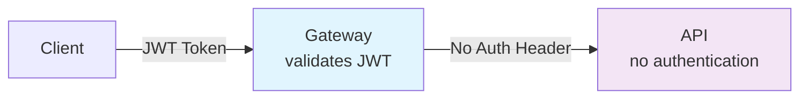
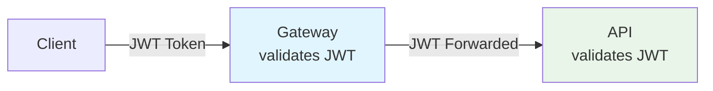
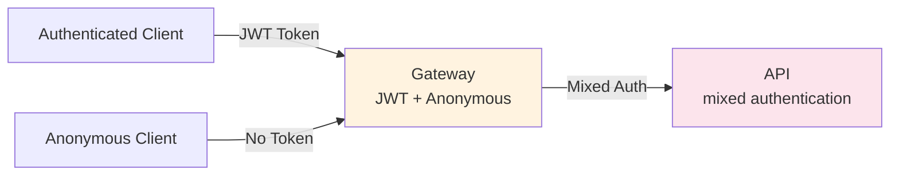

# Microsoft Entra External ID Quick Start Guide

This is a quick reference for setting up Microsoft Entra External ID authentication in Codebreaker projects.

## Prerequisites Checklist

- [ ] Azure subscription
- [ ] Microsoft Entra ID tenant created
- [ ] External ID for customers configured
- [ ] App registrations created for each platform

## 5-Minute Setup

### 1. Entra External ID Setup (2 minutes)

```bash
# Create app registration
az ad app create --display-name "Codebreaker-Gateway" \
  --sign-in-audience AzureADandPersonalMicrosoftAccount \
  --web-redirect-uris https://localhost:7000/signin-oidc

# Get client ID and tenant ID
az ad app list --display-name "Codebreaker-Gateway" --query "[0].appId" -o tsv
az account show --query "tenantId" -o tsv
```

### 2. Gateway Configuration (1 minute)

Add to `appsettings.json`:

```json
{
  "EntraExternalId": {
    "Instance": "https://your-tenant.ciamlogin.com",
    "Domain": "your-tenant.onmicrosoft.com",
    "TenantId": "your-tenant-id",
    "ClientId": "your-client-id"
  }
}
```

Add to `Program.cs`:

```csharp
builder.Services.AddAuthentication(JwtBearerDefaults.AuthenticationScheme)
    .AddMicrosoftIdentityWebApi(builder.Configuration.GetSection("EntraExternalId"));
```

### 3. Client Configuration (2 minutes)

#### Blazor WASM

```csharp
builder.Services.AddMsalAuthentication(options =>
{
    builder.Configuration.Bind("EntraExternalId", options.ProviderOptions.Authentication);
    options.ProviderOptions.DefaultAccessTokenScopes.Add("openid");
    options.ProviderOptions.DefaultAccessTokenScopes.Add("profile");
});
```

#### WPF/MAUI

```csharp
var app = PublicClientApplicationBuilder
    .Create(clientId)
    .WithAuthority($"https://tenant.ciamlogin.com/{tenantId}")
    .WithDefaultRedirectUri()
    .Build();
```

### Setup Flow Overview



**Setup Timeline:**
- **Step 1**: Azure Portal Setup (2 minutes)
- **Step 2**: Gateway Configuration (1 minute)  
- **Step 3**: Client Configuration (2 minutes)
- **Total**: ~5 minutes

## Common Configuration Patterns

### Pattern 1: Gateway Only Authentication



**Best for**: Internal microservices not exposed publicly

### Pattern 2: Defense in Depth



**Best for**: Production environments, public-facing APIs

### Pattern 3: Hybrid Identity



**Best for**: Apps supporting both authenticated and anonymous users

## Configuration by Platform

| Platform | Package | Redirect URI Format |
|----------|---------|---------------------|
| Blazor Server | Microsoft.Identity.Web | `https://host/signin-oidc` |
| Blazor WASM | Microsoft.Authentication.WebAssembly.Msal | `https://host/authentication/login-callback` |
| WPF | Microsoft.Identity.Client | `https://login.microsoftonline.com/common/oauth2/nativeclient` |
| MAUI | Microsoft.Identity.Client | `msauth.com.yourapp://auth` |
| Uno Platform | Microsoft.Identity.Client | `msauth.com.yourapp.xaml://auth` |
| WinUI | Microsoft.Identity.Client | `https://login.microsoftonline.com/common/oauth2/nativeclient` |

## Environment-Specific Configuration

### Development

```json
{
  "EntraExternalId": {
    "Instance": "https://localhost:7000",
    "ValidateAuthority": false
  }
}
```

### Production

```json
{
  "EntraExternalId": {
    "Instance": "https://your-tenant.ciamlogin.com",
    "ValidateAuthority": true
  }
}
```

Store secrets in Azure Key Vault:

```csharp
builder.Configuration.AddAzureKeyVaultSecrets("gateway-keyvault");
```

## Token Scopes Quick Reference

### Default Scopes (Always Include)

```csharp
var scopes = new[] { "openid", "profile" };
```

### API Access Scopes

```csharp
var scopes = new[] 
{ 
    "openid", 
    "profile",
    "https://your-tenant.onmicrosoft.com/api/Games.Play",
    "https://your-tenant.onmicrosoft.com/api/Games.Query"
};
```

### Admin Scopes

```csharp
var scopes = new[] 
{ 
    "openid", 
    "profile",
    "https://your-tenant.onmicrosoft.com/api/Games.Admin"
};
```

## Testing Checklist

- [ ] User can sign in
- [ ] Token is obtained successfully
- [ ] Token is included in API requests
- [ ] API validates token correctly
- [ ] User can sign out
- [ ] Token refresh works silently
- [ ] Invalid tokens are rejected
- [ ] CORS configured correctly (web apps)

## Troubleshooting Quick Fixes

### Error: "CORS policy blocked"

```csharp
// Add before UseAuthentication()
app.UseCors(policy => 
    policy.WithOrigins("https://your-client.com")
          .AllowAnyMethod()
          .AllowAnyHeader()
          .AllowCredentials());
```

### Error: "Redirect URI mismatch"

Check Microsoft Entra admin center → App Registration → Authentication → Redirect URIs

### Error: "Token validation failed"

```csharp
// Enable logging
builder.Services.AddAuthentication()
    .AddMicrosoftIdentityWebApi(options =>
    {
        options.Events = new JwtBearerEvents
        {
            OnAuthenticationFailed = context =>
            {
                Console.WriteLine($"Auth failed: {context.Exception}");
                return Task.CompletedTask;
            }
        };
    });
```

### Error: "MsalUiRequiredException"

```csharp
// Always try silent first, fall back to interactive
try
{
    result = await app.AcquireTokenSilent(scopes, account).ExecuteAsync();
}
catch (MsalUiRequiredException)
{
    result = await app.AcquireTokenInteractive(scopes).ExecuteAsync();
}
```

### Error: "Authority validation failed"

Check that:
- Tenant ID is correct
- Using `.ciamlogin.com` endpoint (not `.b2clogin.com`)
- Authority format: `https://tenant.ciamlogin.com/tenant-id`

## Code Snippets

### Minimal Gateway Setup

```csharp
var builder = WebApplication.CreateBuilder(args);

builder.Services.AddAuthentication(JwtBearerDefaults.AuthenticationScheme)
    .AddMicrosoftIdentityWebApi(builder.Configuration.GetSection("EntraExternalId"));

builder.Services.AddReverseProxy()
    .LoadFromConfig(builder.Configuration.GetSection("ReverseProxy"));

var app = builder.Build();

app.UseAuthentication();
app.UseAuthorization();
app.MapReverseProxy();
app.Run();
```

### Minimal Blazor Server Setup

```csharp
var builder = WebApplication.CreateBuilder(args);

builder.Services.AddAuthentication(OpenIdConnectDefaults.AuthenticationScheme)
    .AddMicrosoftIdentityWebApp(builder.Configuration.GetSection("EntraExternalId"));

builder.Services.AddRazorPages();
builder.Services.AddServerSideBlazor();

var app = builder.Build();

app.UseAuthentication();
app.UseAuthorization();
app.MapBlazorHub();
app.MapFallbackToPage("/_Host");
app.Run();
```

### Minimal Desktop (WPF/MAUI) Setup

```csharp
public class AuthService
{
    private readonly IPublicClientApplication _app;

    public AuthService(string clientId, string authority)
    {
        _app = PublicClientApplicationBuilder
            .Create(clientId)
            .WithAuthority(authority)
            .Build();
    }

    public async Task<string> GetTokenAsync()
    {
        var scopes = new[] { "openid", "profile" };
        
        try
        {
            var accounts = await _app.GetAccountsAsync();
            var result = await _app.AcquireTokenSilent(scopes, accounts.FirstOrDefault())
                .ExecuteAsync();
            return result.AccessToken;
        }
        catch (MsalUiRequiredException)
        {
            var result = await _app.AcquireTokenInteractive(scopes).ExecuteAsync();
            return result.AccessToken;
        }
    }
}
```

## Migration from Azure AD B2C

### Key Changes

| Configuration | Azure AD B2C | Entra External ID |
|---------------|--------------|-------------------|
| **Config Section** | `AzureAdB2C` | `EntraExternalId` |
| **Endpoint** | `*.b2clogin.com` | `*.ciamlogin.com` |
| **Authority** | `https://tenant.b2clogin.com/tenant.onmicrosoft.com/B2C_1_SUSI` | `https://tenant.ciamlogin.com/tenant-id` |
| **Required Fields** | Instance, Domain, ClientId, SignUpSignInPolicyId | Instance, Domain, TenantId, ClientId |

### Migration Checklist

- [ ] Update configuration section name
- [ ] Change endpoint from b2clogin.com to ciamlogin.com
- [ ] Replace policy ID with tenant ID
- [ ] Update authority format in client apps
- [ ] Test all authentication flows
- [ ] Update redirect URIs if needed

## Next Steps

1. Read the [comprehensive guide](./microsoft-external-id.md)
2. Review [security best practices](./microsoft-external-id.md#security-best-practices)
3. Test your implementation
4. Monitor authentication logs
5. Set up production configuration

## Support

- [Full Documentation](./microsoft-external-id.md)
- [Microsoft Entra External ID Docs](https://learn.microsoft.com/en-us/entra/external-id/)
- [GitHub Issues](https://github.com/CodebreakerApp/Codebreaker.Backend/issues)
